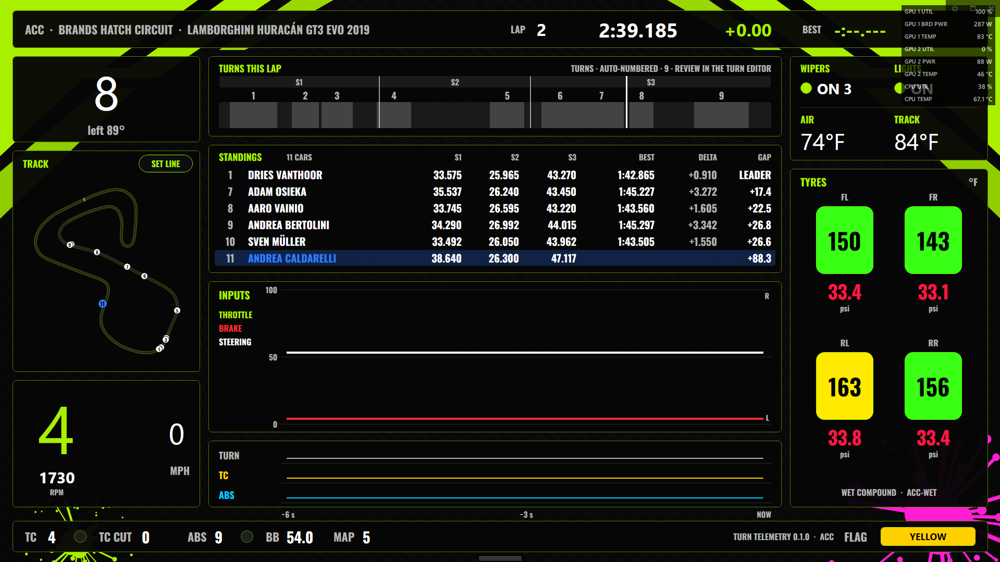

# Turn Telemetry Dashboard for SimHub

A SimHub plugin and 1920×1080 dashboard for a tablet or second screen. It shows your telemetry **turn by turn**:

- **Corners:** which corner you're at.
- **Sectors:** how each sector compares (purple, green, yellow), and where you exceeded track limits.
- **Standings:** best sectors, best laps, and gaps.
- **Inputs and tyres:** live throttle, brake and steering, plus colour-coded tyre temperature and pressure.

The corner tile carries on from [Assetto Corsa Turns](https://github.com/StormFuel/assetto-corsa-turns).



## Install

1. Download **`TurnTelemetry-v<version>.zip`** from the [latest release](https://github.com/StormFuel/simhub-turns-dash/releases/latest) and unzip it.
2. Double-click **`Install.cmd`**. It finds SimHub, waits for SimHub to close, and installs the plugin and dashboard.
3. Start SimHub, enable **Turn Telemetry** when asked, and show **Turn Telemetry Dashboard** on your tablet (`http://<your-pc-ip>:8888`) or second screen.

Uninstall with `Uninstall.cmd`. If you'd rather install by hand, the [user guide](docs/user-guide.md#install) shows how.

## Features

- **Turns this lap:** each corner as a band on a lap strip. The corner you're in is shown in neon blue, and the next one in the turn tile. Curated official numbering is included for some tracks, and the rest are auto-numbered from SimHub's track maps. Tap **SET LINE** at the start line, or use the turn editor, to fix numbering.
- **Sectors:** timed live and coloured purple (fastest of anyone), green (your best), yellow (slower) or red (track limits exceeded). Boundaries are learned the first time you cross them.
- **Track limits per turn:** a red marker on the corner where you went off, and a session count.
- **Standings:** position, driver, best S1–S3, best lap, delta to the fastest, and gap to the leader. Your row is always shown.
- **Live inputs:** throttle, brake and steering over the last 6 s, plus TC/ABS intervention.
- **Tyres:** blue cold, green ideal, yellow above, red overheated, with pressures. Presets are per sim and compound.
- **Car and conditions:** RPM (red on the limiter), TC, TC cut, ABS, brake bias, engine map, flag, wipers, lights, and air and track temperature.
- **Multi-sim:** Assetto Corsa and ACC are tested. Other sims work as far as SimHub provides the data. See [what each sim supports](docs/user-guide.md#what-each-sim-supports).

### Known limits

- **ACC races:** ACC reports nothing about track limits in races, so the dashboard shows *TRACK LIMITS N/A IN RACE*. ACC practice/qualifying and AC work.
- **TC cut, wipers, lights:** ACC only; other sims show N/A.
- **Sectors:** appear after you've crossed each sector line once on a new track.

## Plugin settings

**Turn Telemetry** in SimHub's left menu has these sections:

- **Settings:** pressure unit and tyre wear meaning.
- **Turn editor:** fix corner numbering and names.
- **Good to know:** what each sim supports.
- **Live diagnostics:** what the plugin sees, useful when reporting an issue.


## Roadmap

- **In-game overlays:** the same components (lap strip, standings, inputs, tyres) as separate overlays with transparent backgrounds, for drivers who want them on the game screen instead of a tablet.

## Documentation

- [docs/user-guide.md](docs/user-guide.md): install, screen guide, colours, sim support, troubleshooting
- [docs/architecture.md](docs/architecture.md): components, data flow, the plugin-to-dashboard property contract
- [docs/design.md](docs/design.md): layout, colour rules, typography, themes
- [docs/plan.md](docs/plan.md): decision record and roadmap
- [docs/test-plan.md](docs/test-plan.md): in-sim checks and findings

## Building from source

Requires the .NET SDK (8 or later), Python 3, and SimHub at the default path (`-p:SimHubDir=...` otherwise).

```powershell
dotnet test plugin/TurnTelemetry.slnx                                              # unit tests
dotnet build plugin/TurnTelemetry/TurnTelemetry.csproj -c Release -p:Deploy=true   # build + copy into SimHub (close SimHub first)
python tools/build_dash.py --install                                               # generate the dashboard + copy into SimHub
python tools/package_release.py                                                    # release zip + .simhubdash into dist/
```

The dashboard is generated by `tools/build_dash.py`; don't edit the `.djson` by hand. A plugin-free live-input dashboard ([dash/LiveTraceSpike](dash/LiveTraceSpike/README.md)) is kept as a possible standalone release.

Style note: the dashboard art is generated and inspired by action-sports liveries in general. It uses no third-party logos, names or marks.
