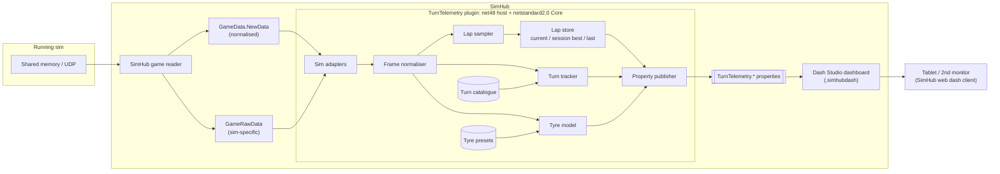

# Turn Telemetry: Architecture

Turn Telemetry is a SimHub dashboard for a 1920×1080 tablet or second monitor. It is backed by a companion SimHub plugin. It brings the turn awareness of the [Assetto Corsa Turns](https://github.com/StormFuel/assetto-corsa-turns) CSP app to every sim SimHub supports. Instead of per-turn snapshots, it records a continuous, distance-aligned trace of brake, throttle, steering, and TC/ABS interventions for the whole lap. It also shows tyre temperature, pressure, and wear.

Related documents:

- [design.md](design.md): visual system, layout, and colour tokens
- [plan.md](plan.md): delivery phases, verification spikes, and decision record

## Goals

1. **One dashboard for many sims.** All sim-specific logic lives in the plugin, so the dashboard only binds to stable `TurnTelemetry.*` properties.
2. **Continuous lap telemetry.** Brake, throttle, steering, and intervention events are sampled across the full lap, not only inside turns.
3. **Turn awareness without guessing.** Turn numbers come only from explicit data: curated JSON, AC `sections.ini`, or a lap the user marks by hand. Tracks without data show the trace without turn numbers. This carries over the "never invent turn numbers" rule from the Turns app.
4. **Readable at a glance.** The screen should look like a race-car display on carbon fibre, not a telemetry workstation.

## Non-goals (v1)

- Post-session analysis, lap export, or comparison with other drivers (use MoTeC or Garage 61 for that).
- Per-turn history cards and the theme catalogue from the Turns app. Only the NEXT/CURRENT focal tile carries over.
- In-game overlay and small-DDU layouts.

## System overview



The dashboard uses SimHub's built-in properties only for values that are already the same across sims (speed, gear, lap times, fuel, delta). Everything else comes from the plugin.

## Components

### 1. Plugin host (`TurnTelemetry`) and Core

The plugin is split in two so the logic can be unit-tested without SimHub:

- **`TurnTelemetry.Core`** (netstandard2.0) holds everything in sections 2–7 below. Its input is a plain `GameSnapshot` (normalised values) plus an `IRawData` lookup (sim-specific values), so tests can feed it without SimHub.
- **`TurnTelemetry`** (net48 host, `TurnTelemetry.dll`) implements SimHub's `IPlugin`, `IDataPlugin`, and `IWPFSettingsV2`. It copies `GameData` into the snapshot (`SnapshotMapper`), runs the engine, publishes properties (`PropertyPublisher`), and shows the settings and diagnostics tab (`SettingsControl`). The **class name is the property prefix**, which is why it is called `TurnTelemetry`.

Details:

- `DataUpdate(PluginManager, ref GameData)` runs at SimHub's data rate (60 Hz). It does nothing while `data.GameRunning` is false or `data.NewData` is null. Exceptions are caught and logged at most every 10 s.
- Session identity is **(GameName, TrackIdWithConfig, CarId, SessionTypeName, SessionId)**. A change to any of these resets lap state and reloads turn and tyre data.
- Paused, replay, and spectating frames update tyres but are not sampled into laps.
- Exposes everything through `AttachDelegate`, so properties are computed lazily by whichever client reads them.
- Registers SimHub actions (bindable to wheel buttons): `MarkTurnStart`, `MarkTurnEnd`, `ClearReferenceLap`.

### 2. Sim adapters (`Sims/`)

These hide per-sim differences behind one interface:

```csharp
interface ISimAdapter
{
    string Id { get; }
    bool Handles(string gameName);
    SimCapabilities Capabilities { get; }        // steering, TC, ABS, wear meaning
    double ReadSteer(IRawData raw);              // -1..+1, NaN when unavailable
    string ReadCompound(IRawData raw);           // player compound label
    TrackFolder ReadTrackFolder(IRawData raw);   // AC-style content/tracks/{track}/{layout}
}
```

Implemented: `GenericAdapter` (everything) and `KunosAdapter` for **AC** (`AssettoCorsa`) and **ACC** (`AssettoCorsaCompetizione`). It reads `Physics.SteerAngle` (−1…+1, confirmed in the Phase 0 spike), `Graphics.TyreCompound`, and `StaticInfo.Track` / `StaticInfo.TrackConfiguration`.

| Concern | Source |
| --- | --- |
| Throttle, brake, speed, lap position, lap/lap-valid, pit state | Normalised `GameData` (`Throttle`, `Brake`, `SpeedKmh`, `TrackPositionPercent`, `CompletedLaps`, `LapInvalidated`, `IsInPitLane`/`IsInPit`) |
| TC / ABS intervention | Normalised `TCActive` / `ABSActive` where the sim provides them. Otherwise the adapter infers them from raw data. |
| **Steering** | **Not normalised by SimHub.** Each adapter reads the raw value from `DataCorePlugin.GameRawData.*` and returns −1…+1 relative to the car's lock. |
| Tyre wear | Normalised `TyreWear*`, but some sims report wear *used* and others wear *remaining*. The adapter's capability says which (default: remaining), the settings tab can override it per game until spike S6b confirms each sim, and the engine converts to **% remaining**. |
| Tyre compound | **Not normalised for the player.** Read by the adapter from raw data. |
| Car class | Normalised `CarClass`; used to pick a tyre preset |

The `GenericAdapter` uses only normalised data. Steering shows as unavailable and the steering lane is hidden. Any sim without a dedicated adapter still gets pedals, TC/ABS (if reported), turns (if catalogued), and tyres.

Adapter priority: **AC and ACC** (installed locally, so they can be validated), then iRacing, LMU/rF2, AMS2, and RaceRoom. Raw property paths are confirmed in SimHub's property browser during Phase 0 (see [plan.md](plan.md)), not assumed.

### 3. Frame normaliser

Turns adapter output into one `Frame` per update:

```text
Frame { t, lapPos (0..1), lap, lapValid, inPit, speedKmh,
        throttle (0..1), brake (0..1), steer (-1..1 | NaN),
        tc (bool), abs (bool), tyres[4] }
```

It also detects **discontinuities** and marks them: a teleport or return to pits, a backwards jump of more than 1% (excluding S/F wrap), or a forward jump of more than 5% in one frame. If a reader reports position as 0–100 instead of 0–1 (any value above 1.5 seen), it switches to percent scale for the rest of the session. A lap that contains a discontinuity can still be displayed but is never used as a reference lap.

### 4. Lap sampler and lap store (`Lap/`)

**Distance binning.** The lap is divided into `N` fixed bins (default **400**, about 13 m per bin on a 5 km track). Each bin stores:

| Channel | Aggregation within bin |
| --- | --- |
| throttle, brake | mean |
| steer | mean (signed) |
| speed | mean |
| tc, abs | any (flag) |

If the car skips bins between two frames (low frame rate or very high speed), the skipped bins are linearly interpolated so the trace has no gaps. Event flags are not interpolated.

**Lap closure.** A lap closes on whichever arrives first: `CompletedLaps` increments, or track position wraps from above 0.9 to below 0.1. The other signal is ignored for 3 s. If the counter ticks before the position wraps, samples are skipped until the wrap, so the end of the old lap doesn't leak into the new one.

**Lap time.** If the sim's `LastLapTime` changes within 3 s of closing and is within 1 s of the plugin's own timing (the highest `CurrentLapTime` seen), the sim's value is used. Otherwise the plugin's own timing is used.

When a lap closes, it becomes the last lap. It becomes the session best if it is:

- valid: never flagged `LapInvalidated` (ignoring the first 1 s, when a stale flag from the previous lap may still be set), no discontinuities, never in the pit lane, and not the first lap of the session
- at least 95% covered: bins actually visited, not interpolated
- faster than the current session best

**Reference.** The reference lap is the session best, or the last lap until a valid lap exists. `Ref.Kind` tells the dashboard which one is shown. References are kept in memory only and are cleared when the session changes.

### 5. Live window (no plugin buffer)

The 6 s live window is drawn by Dash Studio `ChartItem`s, which keep their own sample history (D11). The plugin therefore has **no rolling buffer**. It only publishes current values: `Live.*`, including `Live.Steer` for sims whose steering needs an adapter and `Live.InTurn` (0/1) for a turn-presence lane.

### 6. Turn catalogue and tracker (`Turns/`)

**Catalogue resolution.** The first match wins. Sources 1–4 carry official numbers; 5–6 are automatic starting points, flagged `auto-…` so the dashboard says *AUTO-NUMBERED · REVIEW IN THE TURN EDITOR*.

1. **User file**: `<SimHub>/PluginsData/TurnTelemetry/turns/<GameName>/<TrackIdWithConfig>.json` (names sanitised for the file system). Written by the turn editor, the recorder, or by hand.
2. **Bundled curated file** (`curated`): `data/turns/...`, **embedded in `TurnTelemetry.Core.dll`**. Official numbering looked up online and positioned from SimHub's map for that sim (see *Curation* below).
3. **AC `sections.ini` with numbered labels** (`ac-sections`): `Turn 7`, `Turn 7A`, `T7`, `Corner 7`, using the same rules as `TurnState.parseTurnLabel`. The AC folder comes from SimHub's `GamePath` (or the settings override), and the track folder from AC's `StaticInfo`.
4. **Circuit template** (`template`): when SimHub has a map of the track, corners are detected on it and every bundled template of similar length (±3%) is tried. A template is a curated circuit from another sim: official numbers, names, directions, positions. The best start/finish offset is found, and the template is accepted only at a score of 0.80 or above (see *Templates*).
5. **AC section names** (`auto-sections`): unnumbered `sections.ini` sections in lap order, straights and pits excluded, numbered 1…n from start/finish.
6. **SimHub map geometry** (`auto-map`): corners detected on the map (`TrackGeometry`), numbered 1…n from start/finish.
7. **None**: `Turn.Supported = false`. The dashboard briefly shows a notice and points to the turn editor. The lookup is retried every 5 s, because SimHub may download the map, or AC's `StaticInfo` may arrive, after the session starts.

**SimHub track maps.** SimHub keeps `PluginsData/<GameName>/MapRecords/<TrackIdWithConfig>.shtl` (recorded) and `MapRecordsCloud/<TrackIdWithConfig>-<length>.shtl` (downloaded, averaged over many laps). Both are gzipped JSON whose `CarCoordinates` are world positions `[x, y, z]`, each tagged with `p`, the lap fraction in **that game's own** `TrackPositionPercent` scale, so positions found on a map line up exactly with what the plugin sees in that sim. The cloud map is preferred; empty files (seen on this machine) are skipped.

**Corner geometry** (`TrackGeometry`, prototype `tools/trackmap.py`). The map is resampled every 2 m, and the curvature is smoothed over 24 m. Corners use hysteresis: they start below a 350 m radius and continue until the radius exceeds 700 m. Each corner is split at direction changes, same-direction corners within 25 m are merged, and a merged corner is split again at a clear curvature dip between two apexes (below 45% of both). Bends under 18° are dropped. SimHub's world coordinates are left-handed: a positive heading change is a **right**-hander, which was validated against AC Silverstone's named sections. Flat-out kinks fall below these thresholds by design.

**Templates** (`CircuitTemplates`, prototype `tools/circuits.py`). `tools/circuits.py build` turns each reference curated file into `data/circuits/<id>.json`, which holds every turn's label, name, direction, angle, and lap-fraction range. Alignment works like this:

- Every pairing of a template turn with a detected corner gives a candidate start/finish offset.
- At each offset, a template turn matches if a same-direction detected corner **contains** it, or if a similar corner (same direction, angle within a factor of 2) has its apex within 1.2% of a lap.
- The score is the harmonic mean of the share of template turns matched and the share of detected corners explained.

Validation on this machine:

- Re-creating the hand-curated ACC Silverstone and Monza files from the AC templates scores **0.97 and 1.00**, with turn centres within 0.06–0.22% of a lap on average.
- ACC Silverstone's start/finish line, about 2.7 km from AC's, is found automatically.
- COTA matches a second, unnumbered COTA mod at **1.00**.
- Every wrong circuit of the same length scores **≤ 0.60**.

A circuit whose layout differs (e.g. Barcelona without the chicane) scores low and falls back to `auto-map` rather than showing wrong numbers.

**Curation** (`tools/curate_turns.py`). For each track there is a spec, `data/curation/<GameName>/<track>.json`. It lists the official turns in lap order, each tied to a detected corner (`corner`, optionally a `part`), an explicit `range` (for flicks below the detector's threshold or splits at curvature dips, found with the `probe` and `dips` commands), or `fromSections` (numbered AC sections). An optional `dir` is checked against the geometry. The build fails if turns are out of lap order, overlap, or contradict a `dir`. Sources are recorded in the spec and copied into the output file. Specs are not embedded; only `data/turns` and `data/circuits` are.

**Curated file schema** (one file per sim and track, because sims use different start/finish offsets):

```json
{
  "schema": 1,
  "game": "AssettoCorsaCompetizione",
  "track": "spa",
  "trackName": "Circuit de Spa-Francorchamps",
  "lengthMeters": 7004,
  "source": "recorded by <author>, 2026-10",
  "turns": [
    { "label": "1",  "name": "La Source", "start": 0.038, "end": 0.068 },
    { "label": "2",  "name": "Eau Rouge", "start": 0.137, "end": 0.154 }
  ]
}
```

`start` and `end` are lap fractions. A turn whose `start` is greater than its `end` wraps across start/finish.

**Turn editor** (settings tab; D3 amended). The editor lists candidate turns, and the user reviews them before saving:

- **AC sections:** every section of the track's `sections.ini` with its name (`AcSectionCandidates`). Sections named like straights, pits, start, or finish are pre-unticked, and a section split across start/finish (AC files often do this) is merged back into one.
- **Detected corners:** from the session best lap, or the last lap with at least 90% coverage (`CornerDetector`). It looks for runs of steering above 25% of the lap's 95th-percentile steering (minimum 0.03 of lock), smoothed over ±2 bins, split where the direction flips (chicanes), joined across gaps under 0.6% of the lap, and dropped if under 0.4% of the lap. Each corner's start is extended back over the preceding braking zone (up to 3% of the lap). It needs an adapter with steering.
- **Current turns:** the loaded turns, to rename or renumber them.

The user selects the first turn and clicks **Auto-number**: ticked rows are numbered 1, 2, 3… in lap order from that row, wrapping past start/finish. Any number or name can then be edited (e.g. `7A`). **Save** writes the user turn file, which takes precedence over every other source.

**Turn recorder.** The user binds `MarkTurnStart` and `MarkTurnEnd` to buttons (or uses the buttons in the settings tab) and presses them at turn entry and exit. Each completed pair is saved to the user file immediately and reloaded, with the next number after the highest existing label. The first recording on a track starts from whatever turns are already loaded (curated or `sections.ini`), so recording extends that data rather than replacing it. To use official numbering such as `7A`, edit the `label` fields in the file. This is how new tracks get catalogued without guessing.

**Tracker.** A port of `TurnState.atProgress`: circular range test, then the nearest turn behind (last) and ahead (next). It does not depend on event history, so it recovers correctly after a teleport or session restart.

### 7. Tyre model (`Tyres/`)

For each corner (FL, FR, RL, RR) it publishes:

- temperatures: inner, middle, and outer surface plus average, each with a computed **colour**
- pressure in the user's unit (psi, bar, or kPa; converted from `TyrePressureUnit`), with an in-window / low / high state and colour
- wear (% remaining), with a colour
- compound label

**Presets** (`data/tyres/presets.json`, embedded in Core) are matched by sim, compound regex, and car-class regex. All rules in a preset must match. The most specific wins (game 4 points, compound 2, car class 1), and ties go to the earlier preset. A user file `PluginsData/TurnTelemetry/tyres/presets.json` replaces bundled presets with the same `id`. The preset is re-selected whenever the compound changes, for example after a pit stop.

```json
{
  "id": "acc-dry",
  "match": { "games": ["AssettoCorsaCompetizione"], "compound": "(?i)dry" },
  "temp":     { "cold": 60, "optLow": 75, "optHigh": 95, "hot": 105 },
  "pressure": { "optLow": 26.0, "optHigh": 27.0, "unit": "psi" }
}
```

Preset temperatures are °C. **SimHub reports tyre temperatures in the user's display unit** (`TemperatureUnit`), so a sim that sends nothing shows as 0 °C or 32 °F. The model converts to Celsius for colours and the "no data" test, and publishes temperatures in SimHub's unit. **Gap filling:** some sims give only a per-tyre average (ACC: `TyreTemperature<corner>` set, Inner/Middle/Outer empty). The average is then copied into all three zones. Only when every value is empty does the adapter supply raw °C values (AC/ACC: `Physics.TyreTempI/M/O` when populated, otherwise `Physics.TyreCoreTemperature01`–`04`), converted to the display unit; diagnostics then show `temps=raw`. Inner/middle/outer zones are **detected**, not assumed: `ZonesDetected` latches once any tyre's zones differ by more than 0.5 °C in a session. A preset without `pressure` leaves `PressureState` as `UNKNOWN`.

> These values are starting points. Each sim's preset needs to be checked against that sim's own tyre guidance in Phase 3.

The colour is computed **in the plugin** and published as a `#AARRGGBB` string, so the dashboard binds it directly to a fill. The colour scale lives in one place; see [design.md](design.md#tyre-temperature-scale).

Left and right tyres are mirrored: inner is always the side nearest the car's centreline. The plugin publishes I/M/O, and the dashboard places them `O M I` on left tyres and `I M O` on right tyres.

### 8. Trace renderer (swappable)

Dash Studio has no line or polyline item that plots against lap distance. Its `ChartItem` is time-based. The lap strip can be drawn in three ways, and the plugin's data model supports all of them. **Phase 0 picks one by measurement**:

| Option | How it works | Quality | Risk |
| --- | --- | --- | --- |
| **A. Plugin-rendered image** | The plugin draws the strip (anti-aliased lines, ghost lap, turn bands, cursor) to a bitmap ~10 times a second. The dashboard shows it in an `ImageItem` bound to a published image. | Best: smooth lines and a true ghost overlay | Whether `ImageItem` accepts a bound, frequently changing image *on the web/tablet client* |
| **B. Native `ChartItem`** | One chart per channel, bound to current values; the chart keeps its own history | Good for the rolling window only | Time-based, so it cannot draw a distance-aligned lap |
| **C. Generated columns** | A build tool inserts `N` thin rectangles per lane into the `.djson`, each height bound to `TurnTelemetry.Lap.Cur.<ch>.<i>` | Stepped look, but works everywhere | Item count (≈ 200 columns × 3 lanes × 2 laps) may be heavy for the web client |

**Decided for the live window (D11): B.** `ChartItem` draws one line per chart, so each channel is its own chart, and the charts are overlaid with transparent backgrounds. This needs no plugin for throttle, brake, or TC/ABS, which is why the live window is built first ([plan.md](plan.md), Phase 0).

**Full-lap strip: still open.** **A** is preferred and **C** is the fallback, decided by spikes S1 and S3. Every option draws from the same lap store, so changing the renderer does not affect the rest of the plugin.

### 9. Settings and persistence

- `ReadCommonSettings` / `SaveCommonSettings` (`TurnTelemetrySettings`) store the pressure unit, bin count, AC folder override, unsupported-notice duration, and per-game wear meaning. Changes apply from the next session.
- User turn files and tyre preset overrides are JSON under `PluginsData/TurnTelemetry/`, so they survive plugin upgrades.
- The settings tab shows live diagnostics, like the Turns app: game and adapter, track key, turn source, count, and file, last/current/next turn, live inputs including raw steering, lap coverage and validity, last and best lap times, tyre preset, and per-corner tyre values. It also has the recorder buttons.

## Property contract (plugin → dashboard)

The dashboard depends on these names. Changing one is a breaking change and needs a `Contract` version bump. Every name is prefixed `TurnTelemetry.`.

| Group | Properties |
| --- | --- |
| Meta | `Contract` (int), `Version`, `Adapter`, `Caps.Steering`, `Caps.TC`, `Caps.ABS`, `Caps.TyreWear` (false: `.Wear` is null), `Caps.LapPosition` (false in open-world sims such as Forza Horizon: hide lap and turn elements) |
| Live | `Live.Throttle`, `Live.Brake` (0–100), `Live.Steer` (−1…+1, null when unavailable), `Live.TC`, `Live.ABS`, `Live.LapPos` (0–1), `Live.InTurn` |
| Turn state | `Turn.Supported`, `Turn.Source` (`user`/`curated`/`ac-sections`/`none`), `Turn.Count`, `Turn.State` (`NEXT`/`CURRENT`/`NONE`), `Turn.Focal.Label`, `Turn.Focal.Name`, `Turn.Last.Label`, `Turn.NoticeVisible`, `Turn.Detail` |
| Turn bands | `Turn.Band.<nn>.Start`, `.End`, `.Label`, `.IsCurrent` for `nn` = `00`…`39` (Start/End −1 past `Count`) |
| Sectors | `Sector.Count` (0 until a boundary is known), `Sector.Current` (1-based), `Sector.<1..6>.Start` / `.End` (lap position, −1 when absent), `.State` (`NONE`/`INVALID`/`SLOWER`/`PERSONALBEST`/`SESSIONBEST`), `.FromLastLap` (not reached yet this lap: last lap's result), `.Time` (formatted), `Turn.Band.<nn>.Sector`. SimHub gives only the car's sector index, so `SectorMap` learns each boundary where the index steps up and saves it to `PluginsData/TurnTelemetry/sectors/<game>/<track>.txt`. `SectorTimer` times sectors from the sim lap timer at those steps: purple = fastest by anyone (all drivers' best sectors from the standings), green = personal best (the game's figure from the driver list or SimHub's `SectorNBestTime`, else the plugin's best clean time), yellow = slower, red (`INVALID`) = a track-limit excursion (`TrackLimits.Incidents`) or pit lane during that sector. |
| Track limits | `Limits.Available` (false in ACC races: ACC never fills `NumberOfTyresOut` and doesn't invalidate laps in races, so nothing is detectable; `SimCapabilities.InvalidatesLapsInRace`), `Turn.Band.<nn>.LimitsLap` / `.LimitsSession` (excursions pinned to that turn), `Limits.SessionTotal`, `Limits.LastTurn`, `Limits.Source` (`tyres out` / `lap invalidated` / `none`), `Car.TyresOut` (null when not reported). `TrackLimits` counts an excursion when the sim's tyres-out count reaches `SimCapabilities.TyresOutLimit` (AC 3; ACC 0, as it never fills the field; read from raw `Physics.NumberOfTyresOut` by name, since SimHub lists raw properties only with its raw-data option on; a name search is the fallback), re-armed after 1 s back on track; any sim's lap-invalidation flag is the fallback (first offence per lap, not double-counted within 3 s of a tyres-out excursion). Each is pinned to the turn containing it, or the nearest one. |
| Laps | `Ref.Kind` (`BEST`/`LAST`/`NONE`), `Ref.LapTime` (s), `Lap.Coverage`, `Lap.Valid`, `Lap.InvalidReason` |
| Tyres | `Tyre.<FL\|FR\|RL\|RR>.Temp.<I\|M\|O\|Avg>`, `.Color.<I\|M\|O\|Avg>`, `.Pressure` (null when absent), `.PressureState` (`UNKNOWN`/`LOW`/`OK`/`HIGH`), `.PressureColor`, `.Wear` (% remaining), `.WearColor`, `Tyre.Compound`, `Tyre.Preset`, `Tyre.PressureUnit`, `Tyre.TempUnit` (`C`/`F`, SimHub's display unit), `Tyre.ZonesDetected` (false: draw one colour per tyre) |
| Car settings | `Car.TCCut`, `Car.Wipers`, `Car.Lights` (null when the sim doesn't report them), `Car.WipersText`, `Car.LightsText` |
| Standings | `Standings.DriverCount`; `Standings.Row<1..6>.Visible`, `.Position`, `.Name`, `.IsPlayer`, `.S1`/`.S2`/`.S3` (best sectors, formatted), `.S<n>Fastest`, `.Best`, `.BestFastest`, `.BestDelta` (best lap vs the session's fastest, or `FASTEST`), `.Gap` (to leader, `LEADER`, or `+n LAPS`). Rows are the top 6 while the player is in them, otherwise the leader plus 5 cars around the player. Built from SimHub's opponent list at 4 Hz (`StandingsBoard`). |
| Recorder | `Recorder.Status` |
| *Planned (full-lap renderer)* | A: `Trace.Lap.Image`, `Trace.Revision`. C: `Lap.Cur.<ch>.<i>`, `Lap.Ref.<ch>.<i>`, `Lap.Evt.<i>`. Added when S1/S3 picks one. |

**Actions.** These can also be bound to wheel buttons under SimHub *Controls and events*:

- `TurnTelemetry.MarkTurnStart`, `TurnTelemetry.MarkTurnEnd`, `TurnTelemetry.ClearReferenceLap`
- `SetStartLine` (D15: the next corner ahead becomes Turn 1; undo within 5 s) and `ResetTurns`

The dashboard calls these directly through `ButtonItem.TriggerAction`.

**SET LINE properties** (contract 2): `StartLine.UndoAvailable`, `StartLine.Message`, `StartLine.MessageVisible`, `Turns.UserNumbering`. Also `Turn.Upcoming.Label` / `.Name` (the turn after the focal one).

The dashboard checks `isnull([TurnTelemetry.Contract], 0)`. If the plugin is missing or the contract version is wrong, it shows a "Turn Telemetry plugin not installed / out of date" banner instead of a blank screen.

## Repository layout

```text
simhub-telemetry/
├─ README.md
├─ docs/                      architecture, design, plan
├─ plugin/                    TurnTelemetry.slnx
│  ├─ TurnTelemetry.Core/     netstandard2.0, no SimHub dependency
│  │  ├─ Input/               GameSnapshot, IRawData
│  │  ├─ Sims/                ISimAdapter, Generic + Kunos (AC/ACC) adapters
│  │  ├─ Lap/                 frame normaliser, lap trace (bins), lap store
│  │  ├─ Turns/               label parser, tracker, sections.ini reader, turn files, catalogue, recorder
│  │  ├─ Tyres/               presets, matcher, colour scale, pressure units, tyre model
│  │  └─ Engine/              TelemetryEngine (session pipeline + recorder actions)
│  ├─ TurnTelemetry/          net48 SimHub host: plugin class, snapshot mapper, properties, settings UI
│  └─ TurnTelemetry.Tests/    xunit (net8.0) against Core
├─ data/
│  ├─ turns/<GameName>/<track>.json
│  └─ tyres/presets.json
├─ dash/
│  ├─ LiveTraceSpike/         generated Phase 0 dashboard (kept; possible standalone release)
│  └─ TurnTelemetry/          main dashboard (Phase 2)
├─ tools/                     carbon texture, dashboard generators, packager
└─ dist/                      release zips (plugin + .simhubdash)
```

The dashboard is kept **unpacked** in git, so diffs show up in review. `tools/pack` zips it into `TurnTelemetry.simhubdash`.

## Testing strategy

- **Unit tests** cover the parts that need no SimHub: turn label parsing (the same cases as the Lua version), the circular tracker including wrap-around turns, bin interpolation, lap validity and closure, tyre colour interpolation, and preset matching.
- **Replay tests** feed recorded `Frame` streams (captured by a debug option in the plugin) through the pipeline and compare the published properties against snapshots.
- **In-sim checks** for AC and ACC are in [test-plan.md](test-plan.md), following the Turns app's approach.

Run the unit tests with `dotnet test plugin/TurnTelemetry.slnx`.
