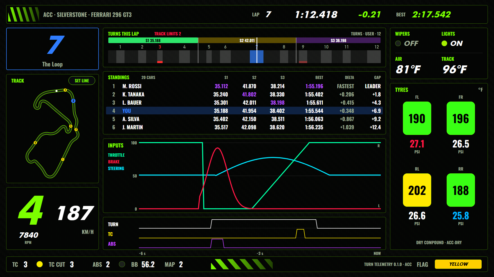
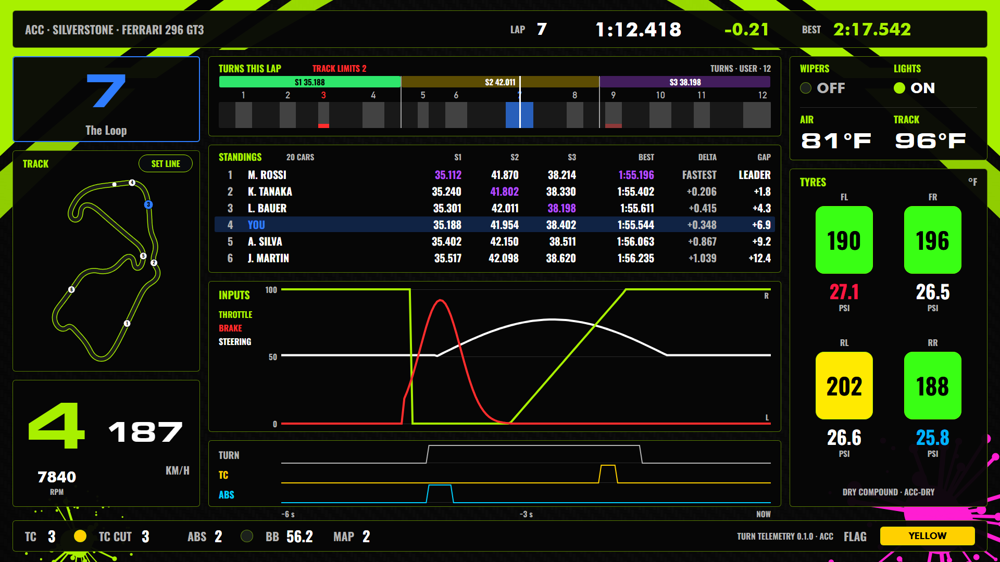

# Turn Telemetry: Visual design

The target is a **1920×1080 landscape** tablet or second monitor, viewed through SimHub's web dashboard client.

## Principles

- **Race-car restraint.** The carbon-fibre base is low contrast, data sits on smoked-glass panels, and lines are hairline thin. Colour is used only for meaning.
- **Hierarchy.** (1) The NEXT/CURRENT turn, (2) the live trace, (3) the full-lap comparison, (4) tyres, (5) status. Prominence comes from size and contrast, not decoration.
- **Stable semantics.** The telemetry colours match the Turns app: brake red, throttle green, steering blue.
- **Graceful absence.** When a sim cannot report a value, its element is hidden or reads `—`. Fake zeros are never shown.

## Layout (1920 × 1080)

```text
┌────────────────────────────────────────────────────────────────────────────────────────────┐
│ ACC · SPA-FRANCORCHAMPS · GT3            LAP 7    1:18.442    Δ −0.214    BEST 2:17.902    │ 64
├────────────────┬─────────────────────────────────────────────────────────────┬─────────────┤
│                │ FULL LAP                                  ref ▸ SESSION BEST │   TYRES     │
│    CURRENT     │   1     2  3      4    5   6       7  8     9  10  11 …       │  FL    FR   │
│                │  ░░░   ░░░░░     ░░░  ░░░ ░░      ░░ ░░░   ░░  ░░░ ░░        │ ▐O M I▌ ▐I M O▌│
│      7A        │  pedals   ── current lap  ┄┄ reference                       │ 27.4  27.6  │
│                │  steering                                                   │ ▮▮▮▮ 96%    │
│                │  events   ▲ TC   ◆ ABS                         │ cursor     │             │
│  ───────────   ├─────────────────────────────────────────────────────────────┤  RL    RR   │
│  LAST  7       │ LIVE · last 6 s                                              │ ▐O M I▌ ▐I M O▌│
│                │  pedals (larger)                                             │ 27.1  27.3  │
│  212 km/h  4   │  steering                                                    │             │
│                │  events                                                      │ DRY · GT3   │
├────────────────┴─────────────────────────────────────────────────────────────┴─────────────┤
│ TC 3 ●    ABS 2 ●    BB 56.2 %    FUEL 12.4 L · 6.1 laps                     ◷ 21:42       │ 56
└────────────────────────────────────────────────────────────────────────────────────────────┘
   360 px                         1160 px                                         400 px
```

- **Focal column (left).** A large NEXT/CURRENT tile. The label changes from white `NEXT` to amber `CURRENT` without the number moving, as in the Turns app. Below it are the last completed turn, speed, and gear in smaller type. On unsupported tracks the tile shows `—` and a small `NO TURN DATA` caption.
- **Full-lap strip (centre top).** The x-axis is lap distance from 0 to 100%. Turn bands are shaded across all lanes with labels above. The current turn's band is tinted amber. The current lap draws as solid lines and the reference lap as faint dashed lines. A vertical cursor marks the car's position.
- **Live window (centre bottom).** The last 6 s, scrolling right to left. It has the same lanes at roughly twice the height and is the "right now" view.
- **Tyres (right).** Four tyres arranged as on the car. See below.
- **Status bar.** TC and ABS level with live intervention lights, brake bias, fuel, and clock.

### Lanes

| Lane | Content | Scale |
| --- | --- | --- |
| Inputs | throttle, brake, and signed steering overlaid in one box | pedals 0–100%; steering centred on the 50 line, right lock at the top |
| Events | TC ▲ (amber) and ABS ◆ (violet) tick marks | presence only |

Pedals and steering were separate lanes until 2026-10-03, when the user asked for them in one box to make room for the standings. The live window is short (6 s), so the three traces stay readable overlaid.

## Colour tokens

| Token | Value | Use |
| --- | --- | --- |
| `bg.carbon` | texture (see below) | full-screen base |
| `panel` | `#0B0E13` at 82% | smoked-glass panels |
| `hairline` | `#2A313C` | panel borders, grid |
| `text` | `#F7F9FC` | primary values |
| `text.muted` | `#8B97A8` | labels, units |
| `accent` | `#59D7FF` | NEXT label, cursor (Graphite theme from Turns) |
| `current` | `#FFB020` | CURRENT label, current turn band (18% fill) |
| `band` | `#FFFFFF` at 5% | inactive turn bands |
| `brake` | `#FF4B3E` | brake trace |
| `throttle` | `#2EE66B` | throttle trace |
| `steer` | `#3BA7FF` | steering trace |
| `evt.tc` | `#FFB020` | TC ticks and light |
| `evt.abs` | `#B98CFF` | ABS ticks and light |
| `ref` | the channel colour at 35%, dashed | reference lap |

## Tyre temperature scale

The plugin computes each colour from the matched preset (`cold`, `optLow`, `optHigh`, `hot`):

| Range | Colour |
| --- | --- |
| no data | `#3A414C` |
| below optLow | `#3B82F6` blue (cold) |
| optLow → optHigh | `#2EE66B` green (ideal) |
| optHigh → hot | `#FFD60A` yellow (above ideal) |
| ≥ hot | `#FF3B30` red (overheated) |

Four discrete states with no blending, so a tyre always reads as exactly one of cold, ideal, warm or overheated (user feedback 2026-10-03: blended in-between hues weren't readable).

Each tyre is a rounded rectangle split into three vertical stripes (O/M/I, mirrored left to right), each filled with its stripe's colour. Below each tyre:

- **Pressure**: value in the user's unit. White when in window, blue when low, red when high.
- **Wear**: thin horizontal bar plus `%` remaining. White above 50%, amber from 25 to 50%, red below 25%.
- The average temperature appears as small numerals inside the tyre.

## Typography

These fonts ship with SimHub (`DashFonts/`), so the dashboard does not need to embed them:

- **Oswald Medium / SemiBold** for large numerals (focal turn number, lap time, gear)
- **Roboto Condensed** for labels, units, and small values, uppercase with +6% letter-spacing for labels

## Carbon fibre background

A tool in `tools/` generates the texture so there is no licensing question. It produces a 2×2 twill weave at about 6 px per tow, in tones `#0A0B0D`–`#17191D`, with a faint diagonal sheen and a vignette. It is exported as a single 1920×1080 PNG. Contrast is kept low enough that it never competes with the traces. A flat-dark variant is available for screens where the texture causes moiré.

## Avoid

- Glows, bevels, chrome gradients, and skeuomorphic gauges
- Manufacturer logos or imitation branding (same rule as the Turns themes)
- More than one accent colour on the same element
- Animation other than the CURRENT colour change and the unsupported-track notice fade

## Neon theme (2026-10-03)

**Turn Telemetry Neon** is a second dashboard with the same layout, features, and bindings. It's built from the same generator with the `neon` token set in [`tools/themes.py`](../tools/themes.py) (`python tools/build_dash.py --theme neon`). It's a high-energy, action-sports look on request. It's an *inspired-by* style only: it uses **no logos, marks, or names of any brand**. The angled-stripe accent is a generic generated motif.



| Token | Classic | Neon |
| --- | --- | --- |
| Signature / NEXT / gear / labels | `#59D7FF` cyan | `#7CFF00` acid lime |
| CURRENT turn, current band | `#FFB020` amber | `#FF2BD6` hot pink |
| Brake / throttle / steering | red / green / blue | `#FF1744` / `#00FFA3` / `#00E5FF` |
| TC / ABS | amber / violet | `#FFEA00` electric yellow / `#C042FF` violet |
| Panels | smoked glass, grey hairline | near-black, lime hairline |
| Tyres (plugin `TyrePalette.Neon`, published as `*.ColorNeon.*`, `*.PressureColorNeon`, `*.WearColorNeon`) | blue / green / yellow / red | `#00B3FF` / `#39FF14` / `#FFEA00` / `#FF1744` |
| Type | DIN throughout | Skate style, both shipped with SimHub. **Futura Bold Oblique** for display text (turn number 190 px, NEXT/CURRENT, gear, speed, lap times, delta, upcoming turn); **Oswald Bold** (fat, condensed) for labels and data so small text stays legible. `8A`, `18`, and `287` checked to fit. |
| Glow | none | **off** since 2026-10-03: WPF blur is GPU shader work, and a GPU driver hang on the test PC followed launching the dash as a local window. `dashlib.glow` remains available (`GLOW` > 0) |
| Trace width | 3 px | 4 px |
| Accents | none | angled lime stripes in the top and status bars |

This theme deliberately relaxes the *Avoid* list above (glows, more than one accent), which still applies to the classic theme.

## Livery theme (2026-10-03)

**Turn Telemetry Livery** has the same layout and features, styled after an action-sports race livery the user shared. It takes the **style only**: no logos, marks, sponsor names, team names, or the original's race number or driver mark. All artwork is generated by [`tools/livery.py`](../tools/livery.py): an SVG rasterised by headless Chrome, seeded so it's reproducible.



- **Background art:** the carbon weave, acid-lime angular wedges sweeping in from both top corners with black pinstripe cuts, a neon-magenta paint splatter in the bottom-right corner, and a small lime splatter bottom-left. It's a static image, so no GPU effects. (White paint drips were tried and dropped on 2026-10-03: barely visible behind the panels.)
- **Panels:** near-opaque (`#F5060606`), so the art shows fully in the gaps and edges but never crosses the data.
- **Palette:** black, white, livery lime `#A8F000` (accents, labels, gear, throttle), neon magenta `#FF1ED2` (the corner you're in, its band, your car on the map, the splatter; replaced orange on 2026-10-03 to move away from a brand's signature colour), white steering trace, yellow TC, cyan ABS.
- **Type:** **Eurostar Black Extended**, a squared, extended race-number face, for the turn number (92 px), gear, and speed; Futura Bold for times and headers; Oswald Bold for labels and data. All three ship with SimHub.


## Car and conditions indicators (2026-10-03, all themes)

Added on request, borrowing the ideas (not the layout) from a reference dash:

- **RPM** below the gear: small white number; bright red (`LIMITER` `#FF1A1A`) while SimHub reports the redline reached.
- **Status bar:** TC (with activity light) · TC CUT · ABS (with light) · BB · MAP, then plugin info, then a **flag swatch** at the far right filled with the current flag's colour and name (`NO FLAG` when clear).
- **Conditions panel** (top of the right column, 200 px): WIPERS and LIGHTS state lights (accent when on), then AIR and TRACK temperature in the display unit. The tyre panel below is shorter (tyre blocks 190 → 130 px) to make room.
- TC cut, wipers, and lights come from the plugin's sim adapter (ACC only so far) and read N/A, muted, elsewhere.

## Standings (2026-10-03, all themes)

Between the lap strip and the inputs box: six rows of position, driver, best sectors S1–S3, best lap, DELTA (best lap against the session's fastest best), and GAP to the leader. The player's row is tinted with the accent colour and their name drawn in it; the session-fastest sector and lap times are purple (`FASTEST` `#B44BFF`, the usual timing-screen convention). Rows show the top six while the player is in them, otherwise the leader plus the five cars around the player. Everything is formatted by the plugin, so the dashboard only binds text.

## Turns this lap: sectors (2026-10-03, all themes)

The lap strip is titled **TURNS THIS LAP** and is 154 px tall:

1. **Sectors:** one segment per sector above the turn bands, labelled with its time (`S2   41.954`) and filled with its pace colour: **purple** = fastest sector by anyone in the session, **green** = your personal best (the game's figure, or the best clean time the plugin timed; a first clean time counts), **yellow** = slower than your best, **red** = track limits exceeded in that sector (the time doesn't count; same red as the track-limit markers). Whether a sector counts is decided per sector, not per lap. A sector you haven't reached yet this lap shows last lap's result, dimmed. A divider runs down through the turn bands at each boundary, so each turn visibly sits in its sector. Boundaries are learned by the plugin the first time the car crosses them and saved per track.
2. **Turn bands** with turn numbers; the turn you're in is neon blue.

The lap cursor is white. Microsectors were tried and dropped the same day: other drivers' microsector times aren't available, so they couldn't be rated like the sectors.

### Colour rules (2026-10-03)

- **Purple, green, and yellow mean pace only** (session best / personal best / slower), as on timing screens. Nothing else uses them for state.
- **Neon blue `#2F7DFF` means "you / now"** in every theme: the current turn (tile number, frame, band, label), your dot on the map, and your standings row. It replaced amber (classic), hot pink (neon), and magenta (livery), which sat too close to purple.

### Track limits on the strip (2026-10-03)

Each turn with a track-limits excursion gets a red bar along the foot of its band: bright red for this lap, dim red for earlier laps this session. Its turn number turns red for an excursion this lap (unless it's the turn you're in, which stays blue). `TRACK LIMITS n` (session total) appears in red beside the strip title once there's one. Red is the warning colour (as brake), separate from the pace colours and the "you" blue.

In an ACC race the game reports no track-limit information at all, so the strip shows `TRACK LIMITS N/A IN RACE` (muted) instead of a count; sectors are still rated, but can't be marked red there. ACC practice/qualifying (lap invalidation) and AC (tyres out) are unaffected.
