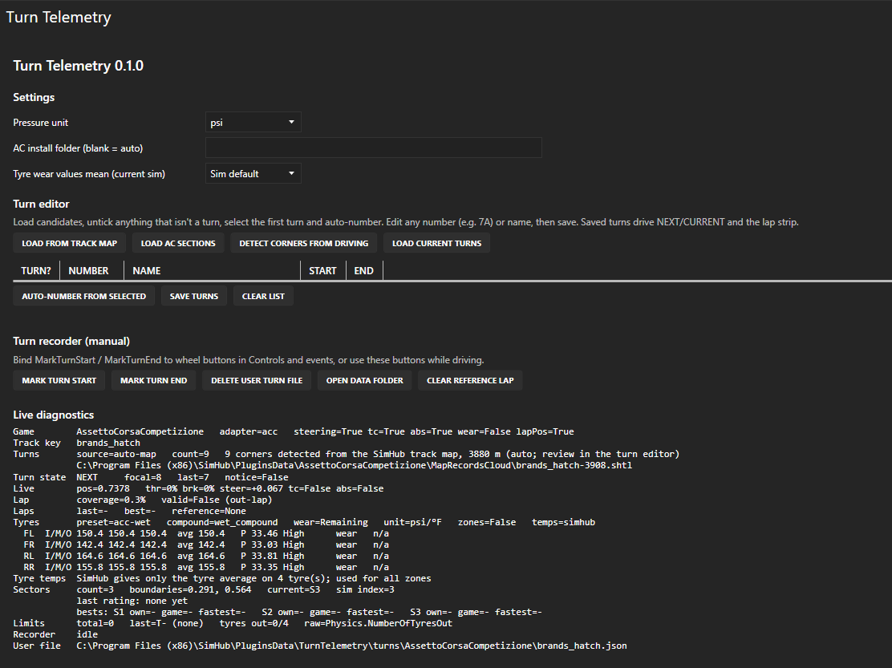

# Turn Telemetry Dashboard: user guide

Turn Telemetry is a SimHub plugin with a 1920×1080 dashboard for a tablet or second screen. It shows your telemetry turn by turn: which corner you're at, how each sector compares, where you exceeded track limits, and your inputs and tyres.

## Install

1. Download `TurnTelemetry-v<version>.zip` from the [latest release](https://github.com/StormFuel/simhub-turns-dash/releases/latest) and unzip it anywhere.
2. Double-click **Install.cmd**. It:
   - finds SimHub;
   - waits for SimHub to close (it can close SimHub for you);
   - copies in the plugin and the dashboard.

   Windows may ask for administrator rights if your SimHub folder needs them.
3. Start SimHub and choose **Yes** when it asks to enable **Turn Telemetry**.
4. Show **Turn Telemetry Dashboard** on your screen:
   - **Tablet:** open `http://<your-pc-ip>:8888` in the tablet's browser and pick it. This is recommended: the tablet draws the dashboard, so your PC's graphics card doesn't.
   - **Second monitor:** pick it in Dash Studio.

To update, run the new version's Install.cmd; it replaces the old files. To remove, run **Uninstall.cmd**. Your turn edits and learned sectors are kept in `SimHub\PluginsData\TurnTelemetry`.

**Manual install:**
1. Close SimHub.
2. Copy `plugin\TurnTelemetry.dll` and `plugin\TurnTelemetry.Core.dll` into the SimHub folder. If Windows blocked them, first right-click each one, open **Properties** and tick **Unblock**.
3. Double-click `TurnTelemetryDashboard.simhubdash` to import the dashboard.

## What's on the screen

| Area | What it shows |
| --- | --- |
| **Top bar** | Game, track, car; lap number, current lap time, delta to your best lap (green ahead, red behind), best lap |
| **Turn tile** (top left) | The number and name of the corner ahead, or the one you're in (neon blue with a frame) |
| **Track map** | SimHub's map with your car (blue) and other cars. **SET LINE**: see [Turn numbers](#turn-numbers) |
| **Gear / speed / RPM** | RPM turns bright red on the limiter |
| **Turns this lap** | The lap from start to finish: sectors on top, then a band per corner with its number, and a white marker for your position |
| **Standings** | Six rows: position, driver, best S1/S2/S3, best lap, delta to the fastest lap, gap to the leader. You're the blue row. Further back than P6, it shows the leader plus the cars around you |
| **Inputs** | The last 6 s of throttle, brake and steering in one chart (steering centred on the 50 line, right lock at the top) |
| **Turn / TC / ABS** | When you were in a corner, and when TC and ABS intervened |
| **Wipers, lights, air, track** | Wiper and headlight state; air and track temperature |
| **Tyres** | Temperature colour: blue cold, green ideal, yellow above ideal, red overheated. Pressure is coloured low (blue) or high (red), with the tyre compound below |
| **Bottom bar** | TC, TC cut, ABS, brake bias, engine map, and the current flag |

### Colours

The dashboard keeps colours to fixed meanings:

- **Purple, green, yellow** are pace only, as on timing screens: fastest of anyone in the session, your personal best, slower than your best.
- **Red** is track limits, a sector with track limits exceeded, and the brake trace.
- **Neon blue** is *you / now*: the corner you're in, your car on the map, your standings row.

### Sectors

Each sector on the strip shows its time and a colour:

- **purple:** fastest of anyone in the session;
- **green:** your personal best (your first clean time in a sector counts);
- **yellow:** slower than your best;
- **red:** you exceeded track limits in that sector, so the time doesn't count.

A sector you haven't reached yet this lap shows last lap's result, dimmed.

SimHub reports which sector you're in but not where the sector lines are. So each boundary is learned **the first time you cross it**, then saved for that track. On a new track the sector row fills in during your first lap.

### Track limits

Each excursion is pinned to the nearest corner. That corner's band gets a **red bar**, bright for this lap and dim for earlier laps. Its number turns red, and **TRACK LIMITS n** counts the session total.

| Sim | How it's detected |
| --- | --- |
| Assetto Corsa | The game's tyres-off-track count: 3 or more tyres off. Every excursion is counted |
| ACC practice / qualifying | When the game invalidates the lap. Only the **first** offence per lap is counted |
| **ACC race** | **Not available.** ACC reports nothing for track limits in races: its tyres-out value is always 0 and laps aren't invalidated. The strip shows **TRACK LIMITS N/A IN RACE** |
| Other sims | When the sim invalidates the lap, if it reports that |

## Turn numbers

Every track starts with turn data:

- **Curated:** official numbering checked against published track maps. This covers Silverstone and Monza in ACC, and the main GP layouts in AC.
- **Template:** the same official numbering applied to that circuit in another sim, when the track shape matches.
- **Auto-numbered:** corners detected from the SimHub track map or AC section names. The strip says *AUTO-NUMBERED · REVIEW IN THE TURN EDITOR*.

To fix numbering:

- **Quickest:** tap **SET LINE** on the dashboard as you cross the start/finish line. The next corner becomes Turn 1. The button reads **UNDO** for 5 s, and **RESET** later returns to the default numbering.
- **Turn editor:** in SimHub, open **Turn Telemetry** in the left menu. Load candidates, untick anything that isn't a corner, select the first turn, auto-number, rename (e.g. `7A`), and save.

## What each sim supports

| Feature | AC | ACC | Others |
| --- | --- | --- | --- |
| Inputs, gear, speed, RPM, standings, flags, temperatures | ✓ | ✓ | ✓ (if SimHub provides them) |
| Turns, sectors, lap strip | ✓ | ✓ | Needs lap position. Open-world sims such as Forza Horizon show *THIS SIM REPORTS NO LAP POSITION* |
| Track limits | ✓ every excursion | Practice/qualifying: first per lap; **race: N/A** | Lap invalidation, if reported |
| TC cut, wipers, lights | N/A | ✓ | N/A |
| Tyre temperature zones | Inner/middle/outer when reported | One temperature per tyre | As reported |

## Troubleshooting

Open **Turn Telemetry** in SimHub's left menu. The **Live diagnostics** panel at the bottom shows what the plugin sees.

| Symptom | Check |
| --- | --- |
| "TURN TELEMETRY PLUGIN NOT FOUND" on the dashboard | The plugin isn't loaded. Re-run Install.cmd, restart SimHub and enable the plugin when asked (or in **Settings > Plugins**) |
| Sectors don't fill in | `Sectors count=0`: cross each sector line once. If `sim index` never changes, the sim doesn't report sectors |
| Sector colours look wrong | The `bests:` line shows the times each rating used (`own` = timed by the plugin, `game` = from the sim, `fastest` = anyone) |
| No track limits | The `Limits` line: `available=False` means an ACC race (see above). In AC, `tyres out` should change when you go off |
| Turn numbers wrong | Tap **SET LINE** at the start line, or use the turn editor |

## Reporting a problem

1. In SimHub, open **Turn Telemetry** in the left menu and click **Save problem report**. Explorer opens with the report selected, for example `TurnTelemetry-report-20261003-141502.zip`.
2. Attach it to a [GitHub issue](https://github.com/StormFuel/simhub-turns-dash/issues) or your Discord post. Say what happened, roughly when, and on which lap or corner.

**Capturing it in the moment:** bind the **SaveReport** action to a wheel button (SimHub **Controls and events**, under Turn Telemetry). Pressing it saves a report straight away, without leaving the car. Reports are kept in `SimHub\PluginsData\TurnTelemetry
eports`.

**What's in a report:**
- plugin, SimHub and Windows versions;
- the live diagnostics;
- the last 500 plugin events (sessions, turn data used, laps with validity, sector boundaries and ratings, track-limit events, errors);
- your plugin settings and this track's turn and sector files;
- Turn Telemetry's lines from SimHub's log.

Your Windows user name is masked in file paths, and no other drivers' names are included.
